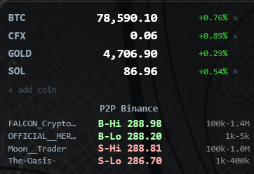

# PakTicker


A lightweight always-on-top desktop ticker for crypto prices and Binance P2P USDT/PKR rates. Sits in the top-right corner, stays out of Alt+Tab and Win+Tab.

## Preview

<div align="center">
  
</div>

## What it shows

**Crypto prices** (via Binance spot API)
- BTC, CFX, GOLD (PAXG proxy) — price + 24h % change
- Add any Binance spot symbol at runtime via the `+ add coin` button
- All coins except GOLD can be removed with the `×` button

**P2P Binance** (USDT/PKR, merchants only)

| Row | Color | Meaning |
|-----|-------|---------|
| B-Hi | Green | Best rate to **buy** USDT — traders accepting 100,000 PKR+ |
| B-Lo | Green | Best rate to **buy** USDT — traders accepting from 1,000 PKR |
| S-Hi | Red   | Best rate to **sell** USDT — traders accepting 100,000 PKR+ |
| S-Lo | Red   | Best rate to **sell** USDT — traders accepting from 1,000 PKR |

Each P2P row shows: `trader name | rate | min-max limit`  
Hover over a row for full tooltip: orders, completion %, available USDT, payment methods.

## How to run

**Recommended — double-click `start.vbs`**  
Launches silently with no console window. On first run it automatically adds itself to Windows startup so the gadget starts with every login.

**Manual (with console window):**
```powershell
powershell -ExecutionPolicy Bypass -File coins_gadget.ps1
```

## Controls

| Action | Result |
|--------|--------|
| Right-click | Confirm close overlay |
| Esc | Dismiss overlay / close |
| Click `+ add coin` | Add any Binance symbol (e.g. `ETHUSDT`) |
| Click `×` on a row | Remove that coin |

## Adding coins

1. Click `+ add coin` at the bottom of the coins section
2. Type a valid Binance spot symbol (e.g. `SOLUSDT`, `BNBUSDT`)
3. Press **Enter** or click **Add** — validated live against Binance API
4. Saved automatically to `coins_config.json`

Coins are loaded from `coins_config.json` on startup. If the file is missing, defaults (BTC, CFX, GOLD) are used.

## Removing startup entry

To stop the gadget from launching at login, delete the `CoinsGadget` entry from:  
`regedit → HKEY_CURRENT_USER\Software\Microsoft\Windows\CurrentVersion\Run`

## Refresh rates

| Data | Interval |
|------|----------|
| Crypto prices | Every 5 seconds |
| P2P rates | Every 10 seconds (4 API calls) |

## License

MIT © 2026

## Customization

- **`$pollSeconds`** — crypto price refresh interval
- **P2P thresholds** — `100000` (hi) and `1000` (lo) in `Update-PKR`
- **`$margin`** — gap from screen edge in pixels
